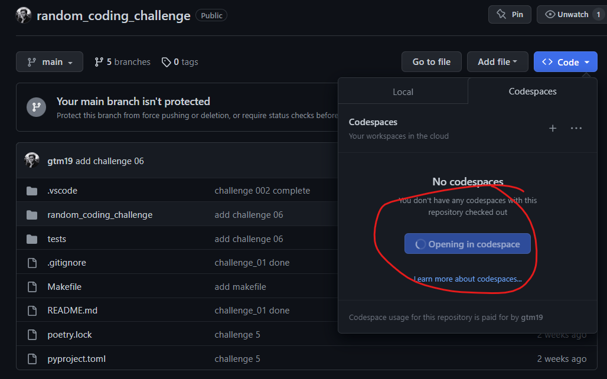

## Random Python Coding Challenges

This repository contains a collection of random Python coding challenges I've completed. Pretty self explanatory.

### GitHub Codespaces

You can open this repo in a _Codespace_ if you want:



Please just make sure to create a new branch before you start working. Do this like so (in the terminal):

```bash
git checkout -b some-branch-name-of-your-choosing
```

Don't worry about the fact that it says I am paying for it - I get a bunch of minutes free 😊